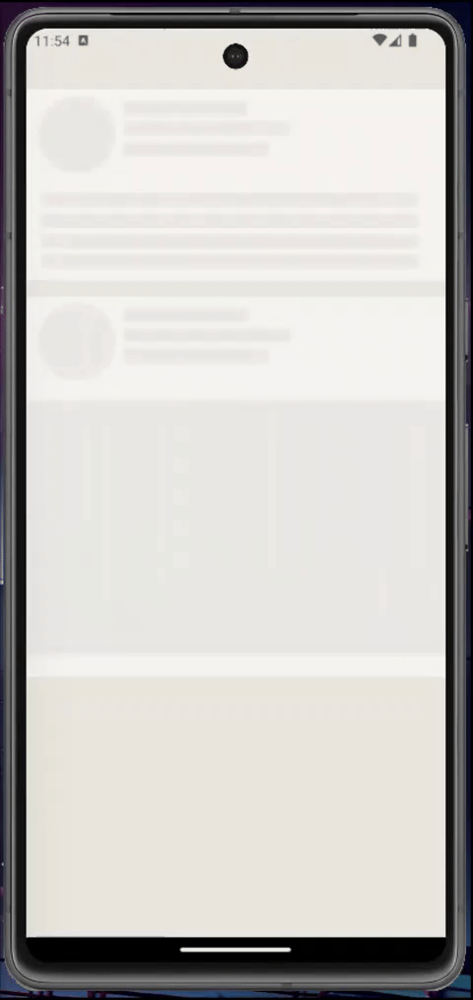

# React Native mini projects

The focus of this mini project is on the use of the [React Content Loader](https://github.com/danilowoz/react-content-loader) package. The loaders were inspired by the loaders of the LinkedIn app.

It is possible to create loaders using this package through the website [https://skeletonreact.com/](https://skeletonreact.com/) in a simple way.

## Preview

